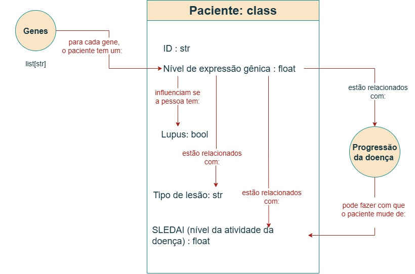

# Projeto Do Gênero ao Genoma: Entendendo o Lúpus através da Visualização de Dados e Análise de Sinalização Celular
# Project From Gender to Genome: Understanding Lupus through Data Visualization and Cell Signaling Analysis

# Descrição Resumida do Projeto

O lúpus é uma doença autoimune de causa multifatorial (genética, hormonal e ambiental), ocorrendo mais comumemente em mulheres e pessoas de ascendência africana, hispânica e asiática, com o cromossomo X sendo um possível fator de risco. O LES é caracterizado por uma falha no sistema imunológico: após a morte celular, fragmentos de DNA e proteínas são erroneamente identificados como invasores, desencadeando uma resposta autoimune que causa inflamação e lesão tecidual. Essa falha está associada a alterações em genes e proteínas ligadas à apoptose. Por ser uma doença crônica e sem cura, o tratamento visa controlar os sintomas, utilizando desde protetor solar e anti-inflamatórios em casos leves, até corticosteroides e imunossupressores em quadros mais graves.

Este estudo busca entender a natureza do lúpus em suas manifestações mais profundas. Primeiramente, investiga a predominância da doença em mulheres, analisando se a expressão de genes em casos graves está ligada a vias de sinalização hormonal, e qual a relevância dessa conexão. Em seguida, foca na progressão da doença, buscando identificar os grupos de genes que diferenciam pacientes estáveis dos que têm surtos recorrentes, para então compreender suas funções celulares. Por fim, o projeto tem uma abordagem terapêutica, procurando identificar um alvo proteico para uma droga que possa prevenir a evolução da forma grave da doença, e explorando se tratamentos tópicos para lesões cutâneas específicas seriam distintos.

# Slides

[Slides da primeira apresentação](assets/slides/<XXX>.pdf)

# Fundamentação Teórica

Os primeiros relatos sobre o lúpus datam da Idade Média, período em que a doença era associada a diferentes condições ulcerativas que acometiam principalmente os membros inferiores. No século XVIII, o lúpus passou a ser descrito como uma erupção nodular na face. O dermatologista húngaro Moritz Kaposi (1837–1902) descreveu duas formas distintas da doença, denominadas, na época, lúpus eritematoso discóide (LED), quando as lesões apareciam em uma única área, e lúpus eritematoso disseminado, quando as lesões acometiam múltiplas regiões do corpo. Mais tarde, Kaposi observou que pacientes com lúpus também apresentavam problemas articulares e diversos sintomas agravantes que frequentemente resultavam na morte do paciente. Essa forma passou a ser conhecida como lúpus eritematoso sistêmico (LES).

No início da década de 1920, surgiram diversos relatos médicos descrevendo manifestações sistêmicas do lúpus, afetando órgãos como o coração e os rins. Em 1950, a identificação da fração plasmática das células de lúpus representou um grande avanço no diagnóstico da doença. Ao longo do século XX, outras descobertas foram relatadas, incluindo formas induzidas por medicamentos e a forma congênita da doença.

De acordo com o Ministério da Saúde, o lúpus “é uma doença inflamatória autoimune, que pode afetar múltiplos órgãos e tecidos, como pele, articulações, rins e cérebro”. Embora sua causa ainda seja indeterminada, sabe-se que há relação com fatores genéticos, hormonais, infecciosos e ambientais. Atualmente, são descritas quatro manifestações clínicas principais:

1. **Lúpus discoide (ou cutâneo)** – lesão restrita à pele, principalmente na face, nuca e couro cabeludo;
1. **Lúpus sistêmico** – forma generalizada, que afeta diferentes órgãos;
1. **Lúpus induzido por medicamentos**;
1. **Lúpus neonatal**.

Embora não exista uma causa única definida, o desenvolvimento das manifestações clínicas está relacionado a gatilhos ambientais, como exposição à luz solar, uso de determinados medicamentos, infecções e estresse.

O diagnóstico é mais frequente entre os 15 e 40 anos, mas pode ocorrer em qualquer faixa etária. É mais comum entre pessoas afro-americanas, hispânicas e asiáticas. Dados epidemiológicos indicam que a incidência chega a ser três a quatro vezes maior em mulheres negras do que em mulheres brancas. De modo geral, a doença acomete mais mulheres do que homens. A razão para essa predominância feminina ainda não é totalmente compreendida, mas há fortes evidências de que esteja relacionada ao processo de inativação do segundo cromossomo X por meio da molécula Xist. Trata-se de um RNA não codificador (ncRNA) presente em fêmeas de mamíferos, responsável pela inativação de um dos cromossomos X. No entanto, essa inativação não é completa, e alguns genes permanecem ativos. Estudos indicam que a ação da Xist, combinada à suscetibilidade genética, favorece o desenvolvimento de autoanticorpos e de doenças autoimunes como o lúpus.

A versão sistêmica do lúpus provém de uma falha no mecanismo de defesa do organismo que resulta em uma doença inflamatória crônica, capaz de afetar múltiplos órgãos e sistemas. Essa condição decorre de um processo de apoptose atípico: quando as células morrem, fragmentos de DNA e nucleossomos permanecem expostos e são captados por células apresentadoras de antígeno, que passam a apresentá-los como se fossem invasores. Esse evento ativa linfócitos T autorreativos, que por sua vez estimulam linfócitos B a produzirem autoanticorpos contra o próprio DNA e proteínas nucleares. A formação de imunocomplexos e sua deposição em tecidos leva à inflamação persistente, ativação do sistema complemento e lesão tecidual. Estudos mostram que essa perda de tolerância está associada a alterações genéticas e funcionais em proteínas-chave das vias extrínseca e intrínseca da apoptose, como Fas, FasL, Bax, Bcl-2 e p53, bem como em seus genes reguladores. A expressão modificada desses genes em células T CD4+ e CD8+, acompanhada por altas taxas de apoptose, contribui para a desregulação das vias apoptóticas e, consequentemente, para a quebra da tolerância imunológica periférica que caracteriza o desenvolvimento do LES.

Os sintomas e a progressão da doença variam de acordo com o órgão acometido e com a eficácia do tratamento. As crises geralmente ocorrem de forma esporádica, com sintomas agudos que podem melhorar ou desaparecer temporariamente. Entre os principais sintomas estão: febre, fadiga, dor nas articulações, inchaço muscular, sensibilidade à luz solar, linfonodos aumentados, queda de cabelo, feridas na boca e rash cutâneo — uma mancha avermelhada nas bochechas e no nariz, em forma de borboleta. As lesões tendem a piorar com a exposição ao sol. Quando não tratado adequadamente, o lúpus pode causar complicações graves e até levar o paciente a óbito. As complicações mais comuns incluem: falência renal, alterações neurológicas (como tontura, mudanças de comportamento, alucinações e derrames cerebrais), além de vasculite, pleurisia, pericardite, entre outras.

O diagnóstico do lúpus ainda representa um desafio, devido à ausência de testes específicos e à grande variedade de sintomas clínicos. Ele é feito por meio de avaliação física, hemograma, exames de urina e testes de anticorpos. O avanço na pesquisa de biomarcadores proporcionou importantes melhorias no processo diagnóstico. Em 2019, os critérios de classificação do LES foram ampliados e refinados pela Aliança Europeia de Associações de Reumatologia (EULAR) em parceria com o Colégio Americano de Reumatologia (ACR). Entre os principais biomarcadores utilizados estão: avaliação da proteinúria, contagem de glóbulos brancos, presença de anemia hemolítica, e níveis de anticorpos antinucleares (ANA), anti-DNA e anti-Sm.

O lúpus é uma doença crônica e sem cura. Os tratamentos disponíveis visam apenas ao controle dos sintomas. Desde 1950, os corticosteroides passaram a ser utilizados como ferramenta terapêutica. Em casos mais leves, são empregados anti-inflamatórios não esteroides, protetor solar e corticosteroides tópicos para as lesões cutâneas. Já em quadros graves, são necessárias drogas imunossupressoras e agentes citotóxicos.

# Perguntas de Pesquisa

1. Porque o lúpus afeta mais mulheres do que homens? Através dos genes mais expressos em pacientes com lúpus grave, conseguimos perceber proteínas ativadas pela rede de sinalização hormonal? Se sim, o quão central esta via de sinalização é para o lúpus?
1. Quais grupos de genes distinguem pacientes que permanecem estáveis daqueles que evoluem para surtos repetidos? Estes genes estão relacionados a quais atividades da célula?
1. Se eu fosse criar uma droga hipotética para evitar que lúpus evoluísse para uma forma grave, qual seria a proteína alvo que faria o maior efeito?
1. Se eu fosse criar uma droga tópica hipotética para cada tipo de lesão cutânea (DLE, sCLE), elas seriam diferentes?

# Bases de Dados

Base de Dados | Endereço na Web | Resumo descritivo
----- | ----- | -----
Gene expression from human discoid (DLE) and subacute (sCLE) cutaneous lupus subtypes | <https://www.ncbi.nlm.nih.gov/geo/query/acc.cgi?acc=GSE81071> | RNA de blocos de biópsias de pele fixados em formalina e embutidos em parafina (FFPE), extraído e processado para hibridização em microarrays da Affymetrix.
SLE lupus RNA-seq | <https://www.ncbi.nlm.nih.gov/geo/query/acc.cgi?acc=GSE72509> | Sequenciamento de RNA (RNA-seq) de sangue PAXgene de doadores com LES e doadores saudáveis, avaliado pelo nível de anti-Ro Assinatura de Interferon.
Longitudinal Stratification of Gene Expression Data Reveals Three SLE Groups of Disease Activity Progression. | <https://www.ncbi.nlm.nih.gov/geo/query/acc.cgi?acc=GSE121239> | Uma matriz de correlação foi calculada para analisar a relação entre a expressão de cada gene e a atividade da doença. Os genes mais relevantes foram selecionados para estratificar os pacientes, permitindo a realização de uma análise de agrupamento para identificar subgrupos.
Gene Ontology | <https://geneontology.org/> | Maior fonte de informações do mundo sobre as funções dos genes.

# Modelo Lógico

# Metodologia
> Esta seção evoluirá ao longo do projeto. Nesta primeira entrega, informe técnicas de Ciência de Redes que pretende explorar,
> tais como: detecção de comunidades, análise de centralidade, predição de links, ou a combinação de uma ou mais técnicas. Descreva o que perguntas pretende endereçar cm a técnica escolhida.

# Ferramentas

É previsto o uso das seguintes ferramentas no projeto:

- **Python** / **Jupyter Notebook**, para processamento das bases de dados e análise dos dados.
- **Cytoscape**, para geração de grafos de redes e análise utilizando técnicas de ciência de redes.

# Referências Bibliográficas

BORBA, Eduardo Ferreira et al. Consenso de Lúpus Eritematoso Sistêmico. **Revista Brasileira de Reumatologia**, v. 48, n. 4, p. 196–207, 2008. Disponível em: [https://doi.org/10.1590/s0482-50042008000400002](https://doi.org/10.1590/s0482-50042008000400002).

Dia Mundial do Lúpus: por que as mulheres estariam mais propensas a desenvolver doenças autoimunes? Disponível em: [https://www.nationalgeographicbrasil.com/ciencia/2024/05/dia-mundial-do-lupus-por-que-as-mulheres-seriam-mais-propensas-a-desenvolver-doencas-autoimunes](https://www.nationalgeographicbrasil.com/ciencia/2024/05/dia-mundial-do-lupus-por-que-as-mulheres-seriam-mais-propensas-a-desenvolver-doencas-autoimunes). Acesso em: 2 set. 2025.

MALLAVARAPU, R. K.; GRIMSLEY, E. W. The history of lupus erythematosus. **Southern Medical Journal**, v. 100, n. 9, p. 896-898, 2007. Disponível em: [https://doi.org/10.1097/SMJ.0b013e318073c9eb](https://doi.org/10.1097/SMJ.0b013e318073c9eb).

MINISTÉRIO DA SAÚDE. **Lúpus**. Disponível em: [https://www.gov.br/saude/pt-br/assuntos/saude-de-a-a-z/l/lupus](https://www.gov.br/saude/pt-br/assuntos/saude-de-a-a-z/l/lupus). Acesso em: 2 set. 2025.

SANTANA, J. A. G. **Lúpus Eritematoso Sistêmico**: sua etiopatologia, patogênese e tratamento em alta. Disponível em: [https://www.ciencianews.com.br/arquivos/ACET/IMAGENS/biblioteca-digital/imunohematologia/4-Lupus-eritemasoso-sistemico.pdf](https://www.ciencianews.com.br/arquivos/ACET/IMAGENS/biblioteca-digital/imunohematologia/4-Lupus-eritemasoso-sistemico.pdf). Acesso em: 2 set. 2025.

WECKERLE, C. E.; NIEWOLD, T. B. The unexplained female predominance of systemic lupus erythematosus: clues from genetic and cytokine studies. **Clinical Reviews in Allergy & Immunology**, v. 40, n. 1, p. 42-49, 2011. Disponível em: [https://doi.org/10.1007/s12016-009-8192-4](https://doi.org/10.1007/s12016-009-8192-4).

YU, H. et al. Clinical and Immunological Biomarkers for Systemic Lupus Erythematosus. **Biomolecules**, v. 11, n. 7, p. 928, 2021. Disponível em: [https://doi.org/10.3390/biom11070928](https://doi.org/10.3390/biom11070928).

GLEESSE, Nadine. **O papel das proteínas apoptóticas na patogênese do lúpus eritematoso sistêmico**: uma abordagem imunogenética. 2015. Tese (Doutorado em Ciências Médicas) - Universidade Federal do Rio Grande do Sul, Porto Alegre, 2015. Disponível em: [https://lume.ufrgs.br/handle/10183/142034](https://lume.ufrgs.br/handle/10183/142034).
