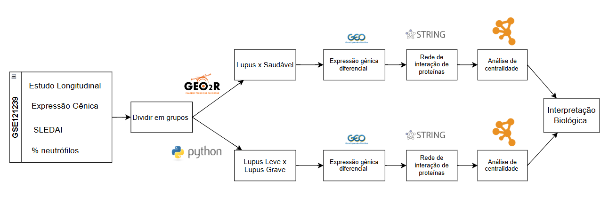
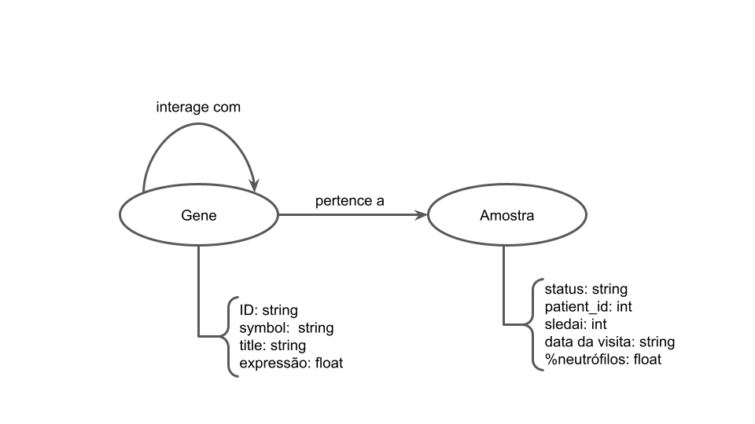
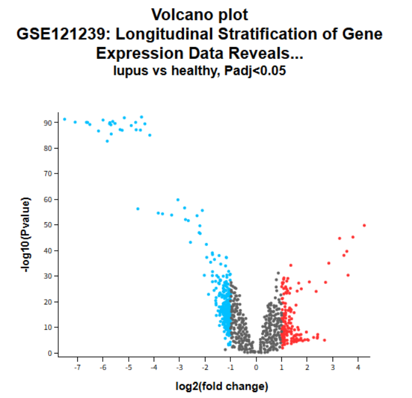
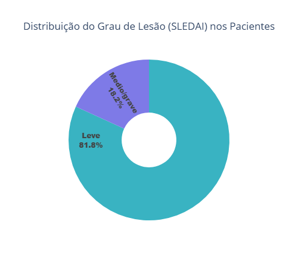

# Projeto Do Gênero ao Genoma: Entendendo o Lúpus através da Visualização de Dados e Análise de Sinalização Celular
# Project From Gender to Genome: Understanding Lupus through Data Visualization and Cell Signaling Analysis

# Descrição Resumida do Projeto

O lúpus é uma doença autoimune de causa multifatorial (genética, hormonal e ambiental), ocorrendo mais comumemente em mulheres e pessoas de ascendência africana, hispânica e asiática, com o cromossomo X sendo um possível fator de risco. O LES é caracterizado por uma falha no sistema imunológico: após a morte celular, fragmentos de DNA e proteínas são erroneamente identificados como invasores, desencadeando uma resposta autoimune que causa inflamação e lesão tecidual. Essa falha está associada a alterações em genes e proteínas ligadas à apoptose. Por ser uma doença crônica e sem cura, o tratamento visa controlar os sintomas, utilizando desde protetor solar e anti-inflamatórios em casos leves, até corticosteroides e imunossupressores em quadros mais graves.

Este estudo busca entender a natureza do lúpus em suas manifestações mais profundas. Primeiramente, investiga a predominância da doença em mulheres, analisando se a expressão diferencial dos genes explicaria esta predominancia. Em seguida, foca na progressão da doença, buscando identificar os grupos de genes que diferenciam pacientes leves dos que têm surtos graves, para então compreender as funções celulares que estes genes exercem.

# Slides

[Slides da segunda apresentação](assets/slides/apresentação-projeto2.pdf)

# Fundamentação Teórica

O lúpus é uma doença autoimune inflamatória crônica que pode afetar múltiplos órgãos, pele, articulações, rins, coração e sistema nervoso.

Do ponto de vista imunológico, o LES resulta de uma falha nos mecanismos de tolerância imune, frequentemente associada a apoptose anormal. Quando as células morrem, fragmentos de DNA e nucleossomos permanecem expostos e são captados por células apresentadoras de antígeno (APCs), que passam a apresentá-los como se fossem invasores. Esse evento ativa linfócitos T autorreativos, que por sua vez estimulam linfócitos B a produzirem autoanticorpos contra o próprio DNA e proteínas nucleares. A formação de imunocomplexos e sua deposição em tecidos leva à inflamação persistente, ativação do sistema complemento e lesão tecidual. Estudos mostram que essa perda de tolerância está associada a alterações genéticas e funcionais em proteínas-chave das vias extrínseca e intrínseca da apoptose, como Fas, FasL, Bax, Bcl-2 e p53, bem como em seus genes reguladores. A expressão modificada desses genes em células T CD4+ e CD8+, acompanhada por altas taxas de apoptose, contribui para a desregulação das vias apoptóticas e, consequentemente, para a quebra da tolerância imunológica periférica que caracteriza o desenvolvimento do LES.

O diagnóstico é mais frequente entre os 15 e 40 anos, mas pode ocorrer em qualquer faixa etária. É mais comum entre pessoas afro-americanas, hispânicas e asiáticas. Dados epidemiológicos indicam que a incidência chega a ser três a quatro vezes maior em mulheres negras do que em mulheres brancas. De modo geral, a doença acomete mais mulheres do que homens. A razão para a predominância do lupus em mulheres ainda não é totalmente compreendida, mas há fortes evidências de que esteja relacionada ao processo de inativação do segundo cromossomo X por meio da molécula Xist. Trata-se de um RNA não codificador (ncRNA) presente em fêmeas de mamíferos, responsável pela inativação de um dos cromossomos X. No entanto, essa inativação não é completa, e alguns genes permanecem ativos. Estudos indicam que a ação da Xist, combinada à suscetibilidade genética, favorece o desenvolvimento de autoanticorpos e de doenças autoimunes como o lúpus.

Clinicamente, o lúpus manifesta-se por fadiga, febre, artralgia, fotossensibilidade, alopecia, linfadenopatia e rash malar em “asa de borboleta”. Em casos graves, podem ocorrer nefrites, vasculites, pleurites, pericardites e alterações neurológicas. O diagnóstico é desafiador e baseado em critérios clínicos e laboratoriais definidos pela EULAR/ACR (2019), incluindo a presença de anticorpos antinucleares (ANA), anti-DNA e anti-Sm, além de achados hematológicos e renais.

O lúpus é uma doença crônica e sem cura. Os tratamentos disponíveis visam apenas ao controle dos sintomas. Desde 1950, os corticosteroides passaram a ser utilizados como ferramenta terapêutica. Em casos mais leves, são empregados anti-inflamatórios não esteroides, protetor solar e corticosteroides tópicos para as lesões cutâneas. Já em quadros graves, são necessárias drogas imunossupressoras e agentes citotóxicos.

## Avaliação Clínica e Índice de Atividade SLEDAI

O curso clínico do LES é marcado por períodos de atividade e remissão, exigindo um acompanhamento constante. Para mensurar a atividade inflamatória sistêmica, foram desenvolvidos índices padronizados, entre eles o ECLAM, SLAM, BILAG e o SLEDAI (Systemic Lupus Erythematosus Disease Activity Index), o mais utilizado mundialmente. Este índice avalia 24 parâmetros clínicos e laboratoriais observados nos últimos 10 dias. Cada item recebe uma pontuação fixa (1, 2, 4 ou 8), de acordo com sua gravidade e impacto fisiopatológico. A soma total define o grau de atividade da doença:

- SLEDAI 1–5: atividade leve
- SLEDAI 6–10: atividade moderada
- SLEDAI 11–19: atividade alta
- SLEDAI ≥ 20: atividade muito alta

Embora o escore máximo teórico seja 105, valores tão altos são raros na prática clínica. O SLEDAI-2K também permite a contagem de alguns achados persistentes (como proteinúria, rash ou alopecia), que na versão original eram contabilizados apenas quando novos.

### Parâmetros clínicos e laboratoriais avaliados no SLEDAI

Os 24 descritores do SLEDAI abrangem 8 sistemas orgânicos, avaliando manifestações inflamatórias ativas atribuíveis exclusivamente ao lúpus (excluindo causas infecciosas, metabólicas ou medicamentosas):

<ol type="a">
    <li>Sistema Nervoso Central (8 pontos cada): Inclui convulsões, psicose, acidente vascular cerebral, cefaleia lúpica e neuropatias cranianas, manifestações que refletem inflamação neurovascular autoimune.</li>
    <li>Sistema Vascular (8 pontos) : Vasculite sistêmica caracterizada por úlceras, nódulos, gangrena digital ou achados angiográficos inflamatórios.</li>
    <li>Sistema Musculoesquelético (4 pontos cada): Abrange artrite inflamatória em múltiplas articulações e miosite confirmada clinicamente ou por exames laboratoriais.</li>
    <li>Sistema Renal (4 pontos cada): Avalia proteinúria, hematúria, piúria e presença de cilindros urinários, indicadores de nefropatia lúpica ativa.</li>
    <li>Sistema Cutâneo e Mucoso (2 pontos cada): Inclui rash cutâneo, alopecia e úlceras orais ou nasais, representando atividade periférica da doença.</li>
    <li>Serosas (2 pontos cada): Pleurite e pericardite, evidenciadas por dor torácica, atrito, derrame ou alterações ecocardiográficas.</li>
    <li>Imunológicos (2 pontos cada): Redução de C3, C4 ou CH50 e elevação de anticorpos anti-DNA de fita dupla, indicando reativação imunológica sistêmica.</li>
    <li>Hematológicos e Constitucionais (1 ponto cada): Febre não infecciosa, leucopenia e trombocitopenia, expressando resposta inflamatória sistêmica e autoimune ativa.</li>
</ol>

# Perguntas de Pesquisa

1. Porque o lúpus afeta mais mulheres do que homens? Através dos genes mais expressos em pacientes com lúpus, conseguimos perceber alguma razão para esta predominância?
2. Quais grupos de genes distinguem pacientes com lupus de pacientes sem lupus? Qual é a sua função na célula?
3. Quais grupos de genes distinguem pacientes que permanecem com estados clínicos leves (baixo SLEDAI) daqueles que evoluem para surtos graves (alto SLEDAI)? Estes genes estão relacionados a quais atividades da célula?
4. Se eu fosse criar uma droga hipotética para evitar que lúpus evoluísse para uma forma grave, qual seria a proteína alvo que faria o maior efeito?

# Metodologia

Os dados utilizados neste estudo foram obtidos do banco público GEO (Gene Expression Omnibus), especificamente do dataset GSE121239, que contém informações de um estudo longitudinal de pacientes com lúpus eritematoso sistêmico (LES). Este conjunto de dados inclui perfis de expressão gênica, escores clínicos de atividade da doença (SLEDAI) e percentuais de neutrófilos. Inicialmente, as amostras foram divididas em grupos de acordo com dois critérios principais:

1. Lúpus versus indivíduos saudáveis
2. Lúpus leve versus lúpus grave, com base no escore SLEDAI.

A separação dos grupos lupus e indivíduos saudáveis foi feita utilizando a ferramenta GEO2R, que permite análises estatísticas diretas a partir da base GEO. Já a separação entre os grupos com lúpus leve e lúpus grave foi feita utilizando Python.

Para cada comparação, foi conduzida uma análise de expressão gênica diferencial, a fim de identificar genes diferencialmente expressos entre os grupos. Em seguida, os genes diferencialmente expressos foram submetidos à construção de uma rede de interação proteína-proteína (PPI) por meio da plataforma STRING, possibilitando a visualização das interações funcionais entre as proteínas codificadas pelos genes identificados.
As redes obtidas foram analisadas quanto à centralidade dos nós, com o objetivo de identificar proteínas potencialmente mais influentes ou centrais nas interações moleculares relacionadas ao lúpus.
Por fim, os resultados das análises de centralidade e interação foram integrados em uma interpretação biológica, buscando compreender os mecanismos moleculares e vias biológicas envolvidas na atividade e gravidade do lúpus eritematoso sistêmico.



## Bases de Dados e Evolução

Base de Dados | Endereço na Web | Resumo descritivo
----- | ----- | -----
Longitudinal Stratification of Gene Expression Data Reveals Three SLE Groups of Disease Activity Progression. | <https://www.ncbi.nlm.nih.gov/geo/query/acc.cgi?acc=GSE121239> | Uma matriz de correlação foi calculada para analisar a relação entre a expressão de cada gene e a atividade da doença. Os genes mais relevantes foram selecionados para estratificar os pacientes, permitindo a realização de uma análise de agrupamento para identificar subgrupos.
Gene Ontology | <https://geneontology.org/> | Maior fonte de informações do mundo sobre as funções dos genes.

Esta base de dados apresenta várias amostras associadas a cada paciente, correspondendo a diferentes visitas deste indivíduo ao longo do tempo. Sendo assim, essa base foi processada de forma a agrupar os dados de cada paciente em um novo conjunto de dados no qual cada entrada corresponde à série histórica de um paciente, permitindo a realização de uma análise da progressão da doença em cada indivíduo.

## Modelo Lógico



## Análise Preliminar

### Lúpus x Saudável

Foi realizada a separação dos grupos de pacientes com lúpus versus indivíduos saudáveis via GEO2R. Utilizamos um limiar de p-valor de 0,05 e limitamos a expressão diferencial para ser log2FC > 1. Depois, colocamos no STRING para gerar a rede de proteínas considerando apenas as interações físicas. A análise de grau e centralidade foi feita no Cytoscape.



A análise de centralidade e conectividade entre proteínas de indivíduos saudáveis revelou genes com alto grau de conectividade (*degree*) e importância topológica (*eigenvector*) nas redes de interação proteína-proteína (PPI). Esses genes representam **nós centrais** com papel potencialmente regulador na fisiopatologia do lúpus.

### Lúpus Leve x Lúpus Medio/Grave

Devido a baixa amostragem de pacientes com SLEDAI grave (maiores que 11), optou-se por agrupar os tipos médios e graves para evitar viéses em análises futuras.




Além disso, o dataset trabalha com dados longitudinais, onde cada paciente possui diversas observações de idas ao médio ao longo do tempo, com diferentes valores de SLEDAI atrelados. Como a base de dados já é suficientemente grande e desproporcional em termos da quantidade de amostras leves e médias/graves, optou-se por selecionar apenas a observação com maior valor de SLEDAI por paciente.

### Proteínas com maior Eigenvector

A análise de centralidade destacou um agrupamento de **ribonucleoproteínas nucleares heterogêneas (hnRNPs)** entre as proteínas mais conectadas: **HNRNPD, HNRNPH1, SRSF6, HNRNPL, HNRNPU, HNRNPR e FUS**.

Essas proteínas participam de processos essenciais do **metabolismo do RNA**, como:

- *Splicing* alternativo
- Estabilização de mRNA
- Regulação da transcrição e tradução

Alterações nesses mecanismos são recorrentes em doenças autoimunes, incluindo o LES.


> Rede de interação entre proteínas, colorida de acordo com centralidade de valor própio.

#### Função e Relevância dos Genes Identificados

**Gene** | **Função Principal** | **Impacto no Lúpus**
-----------|----------------------|----------------------
**HNRNPD (AUF1)** | Regula a estabilidade de mRNAs inflamatórios (ex.: TNF e IL-6). | Sua perda leva ao acúmulo de citocinas pró-inflamatórias → **inflamação sistêmica**.
**HNRNPH1** | Proteína de ligação ao pré-mRNA; atua no *splicing* alternativo e regulação pós-transcricional. | Atua como **autoantígeno** no LES e AR; autoanticorpos contra HNRNPH1 associam-se à **progressão da doença** e têm potencial como **biomarcadores**. [Zhu et al., 2025](https://doi.org/10.3390/ijms26115159)
**SRSF6** | Fator de *splicing* rico em serina/arginina, regula isoformas alternativas. | Superexpressão pode modular o *splicing* de genes ligados à **resposta IFN tipo I** e apoptose. [Kosmara et al., 2023](https://doi.org/10.3390/cells12232678)
**HNRNPL** | Atua no *splicing* de receptores imunes como **CD45** e receptores T. | Alterações em HNRNPL levam à **ativação exagerada de linfócitos T** e resposta autoimune aumentada.
**HNRNPU (SAF-A)** | Proteína nuclear multifuncional que **ancora RNA à cromatina**, organiza a arquitetura nuclear e regula transcrição, *splicing* e reparo de DNA. | Interage com **lncRNA IL21-AS1**, promovendo **IL-21**, ativação de linfócitos B e produção de autoanticorpos. Pode também estar associada à **inativação do cromossomo X**, explicando a **predominância do lúpus em mulheres**. [Liu et al., 2025](https://doi.org/10.1371/journal.pgen.1011719)
**HNRNPR** | Regula o processamento de RNA sob estresse celular. | Amplifica a **sinalização interferon-dependente** e **mecanismos inflamatórios nucleares**.
**FUS** | Mantém a homeostase de RNA e forma condensados nucleares sob estresse oxidativo. | Contribui para a **formação de grânulos inflamatórios**, promovendo inflamação persistente.

#### Significado Biológico Geral

A predominância das **hnRNPs** entre as proteínas centrais sugere que **alterações no processamento e controle pós-transcricional do RNA** representam um **mecanismo-chave do LES**. Essas proteínas formam um **núcleo funcional** responsável por:

- Regular genes interferon-dependentes (ISGs)
- Modular a resposta inflamatória
- Influenciar a organização epigenética do **cromossomo X**

Particularmente, a **HNRNPU** apresentou alta centralidade e relevância biológica por conectar:

- **Genes ISG**, associados ao *IFN signature* do lúpus
- **Mecanismos epigenéticos do cromossomo X**, que podem contribuir para a **predominância feminina da doença**
- **Ativação da via IL-21 → linfócitos B → autoanticorpos**, sustentando a **resposta autoimune exacerbada**

# GEOparse

Existe uma biblioteca chamada GEOparse, disponível em Python, para baixar e tratar diretamente os dados vindos do repositório GEO, sem a necessidade de baixar os dados de maneira externa. Com isso, os dados ficam encapsulados em um objeto contendo os metadados tanto dos pacientes como da expressão gênica de cada paciente. De forma a aproveitar esse recurso, juntamente com o pré processamento específico para tratar os dados de Lúpus, foi construída uma classe GeoParser que absorve os métodos disponíveis na biblioteca original. Com isso, através de apenas duas linhas de código, ambos os dataframes são gerados formatados, pronto para serem analisados.

```python 
# Cria objeto parser
parser = GEOParser(geo_id="GSE121239", destdir="../../data/raw/", meta_map=meta_map)

# Parse dos dados e armazena em tabelas
gene_data, patient_data = parser.parse()
```

# Ferramentas

- **Python** / **Jupyter Notebook**, para processamento das bases de dados e análise dos dados.
- **GEO2R**, para análise de expressão diferencial de genes.
- **STRING**, para obter informações sobre interação entre proteínas.
- **Cytoscape**, para geração de grafos de redes e análise utilizando técnicas de ciência de redes.

# Referências Bibliográficas

BORBA, Eduardo Ferreira et al. Consenso de Lúpus Eritematoso Sistêmico. **Revista Brasileira de Reumatologia**, v. 48, n. 4, p. 196–207, 2008. Disponível em: [https://doi.org/10.1590/s0482-50042008000400002](https://doi.org/10.1590/s0482-50042008000400002).

Dia Mundial do Lúpus: por que as mulheres estariam mais propensas a desenvolver doenças autoimunes? Disponível em: [https://www.nationalgeographicbrasil.com/ciencia/2024/05/dia-mundial-do-lupus-por-que-as-mulheres-seriam-mais-propensas-a-desenvolver-doencas-autoimunes](https://www.nationalgeographicbrasil.com/ciencia/2024/05/dia-mundial-do-lupus-por-que-as-mulheres-seriam-mais-propensas-a-desenvolver-doencas-autoimunes). Acesso em: 2 set. 2025.

MALLAVARAPU, R. K.; GRIMSLEY, E. W. The history of lupus erythematosus. **Southern Medical Journal**, v. 100, n. 9, p. 896-898, 2007. Disponível em: [https://doi.org/10.1097/SMJ.0b013e318073c9eb](https://doi.org/10.1097/SMJ.0b013e318073c9eb).

MINISTÉRIO DA SAÚDE. **Lúpus**. Disponível em: [https://www.gov.br/saude/pt-br/assuntos/saude-de-a-a-z/l/lupus](https://www.gov.br/saude/pt-br/assuntos/saude-de-a-a-z/l/lupus). Acesso em: 2 set. 2025.

SANTANA, J. A. G. **Lúpus Eritematoso Sistêmico**: sua etiopatologia, patogênese e tratamento em alta. Disponível em: [https://www.ciencianews.com.br/arquivos/ACET/IMAGENS/biblioteca-digital/imunohematologia/4-Lupus-eritemasoso-sistemico.pdf](https://www.ciencianews.com.br/arquivos/ACET/IMAGENS/biblioteca-digital/imunohematologia/4-Lupus-eritemasoso-sistemico.pdf). Acesso em: 2 set. 2025.

WECKERLE, C. E.; NIEWOLD, T. B. The unexplained female predominance of systemic lupus erythematosus: clues from genetic and cytokine studies. **Clinical Reviews in Allergy & Immunology**, v. 40, n. 1, p. 42-49, 2011. Disponível em: [https://doi.org/10.1007/s12016-009-8192-4](https://doi.org/10.1007/s12016-009-8192-4).

YU, H. et al. Clinical and Immunological Biomarkers for Systemic Lupus Erythematosus. **Biomolecules**, v. 11, n. 7, p. 928, 2021. Disponível em: [https://doi.org/10.3390/biom11070928](https://doi.org/10.3390/biom11070928).

GLEESSE, Nadine. **O papel das proteínas apoptóticas na patogênese do lúpus eritematoso sistêmico**: uma abordagem imunogenética. 2015. Tese (Doutorado em Ciências Médicas) - Universidade Federal do Rio Grande do Sul, Porto Alegre, 2015. Disponível em: [https://lume.ufrgs.br/handle/10183/142034](https://lume.ufrgs.br/handle/10183/142034).

ZHU, Lijing et al. hnRNPH1: A Multifaceted Regulator in RNA Processing and Disease Pathogenesis. **International Journal of Molecular Sciences**, v. 26, n. 11, p. 5159, 2025. Disponível em: <https://doi.org/10.3390/ijms26115159>

KOSMARA, Despoina et al. Extensive alternative splicing patterns in systemic lupus erythematosus highlight sexual differences. **Cells**, v. 12, n. 23, p. 2678, 2023. Disponível em: <https://doi.org/10.3390/cells12232678>

SHARP, Judith A et al. Role of the SAF-A/HNRNPU SAP domain in X chromosome inactivation, nuclear dynamics, transcription, splicing, and cell proliferation. **PLoS genetics**, v. 21, n. 6, p. e1011719, 2025. Disponível em: <https://doi.org/10.3390/cells12232678>

MARENDA, Mattia; LAZAROVA, Elena; GILBERT, Nick. The role of SAF-A/hnRNP U in regulating chromatin structure. **Current Opinion in Genetics \& Development**, v. 72, p. 38–44, 2022. Disponível em: <https://www.sciencedirect.com/science/article/pii/S0959437X21001271>

LIU, Limin et al. LncRNA IL21-AS1 interacts with hnRNPU protein to promote IL21 overexpression and aberrant differentiation of Tfh cells in systemic lupus erythematosus. **Clinical and translational medicine**, v. 12, n. 12, p. e1117, 2022. Disponível em: <https://onlinelibrary.wiley.com/doi/pdf/10.1002/ctm2.1117>
