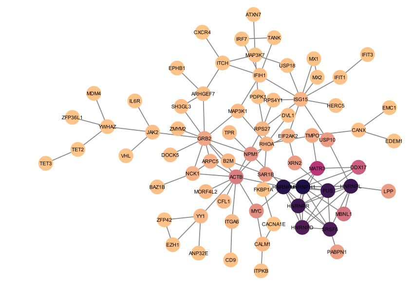
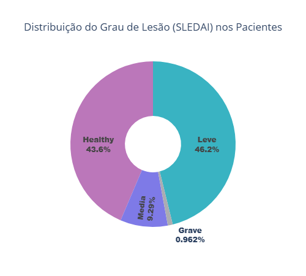
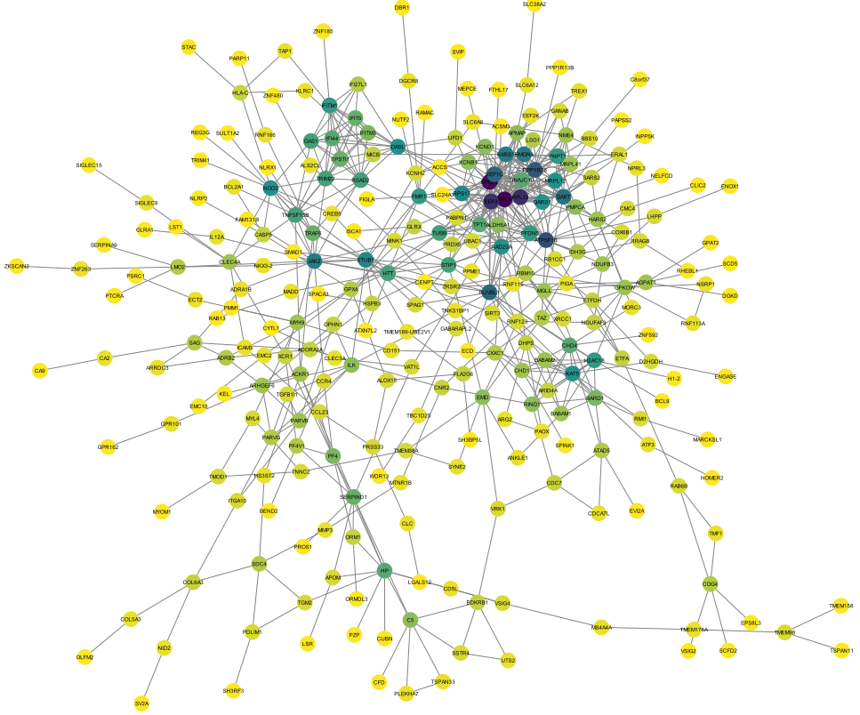
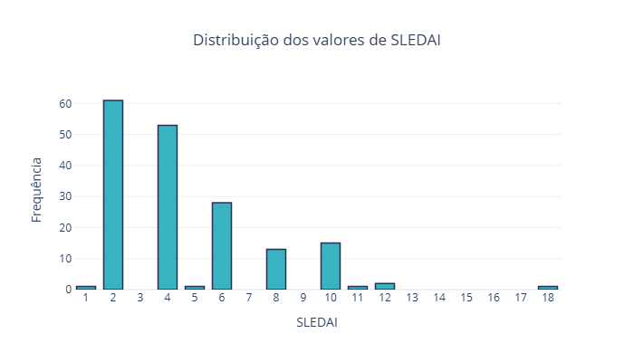
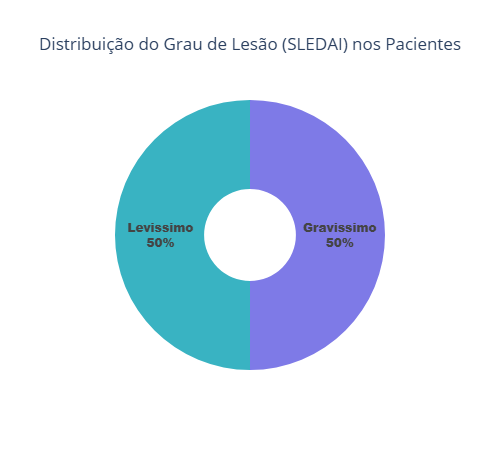
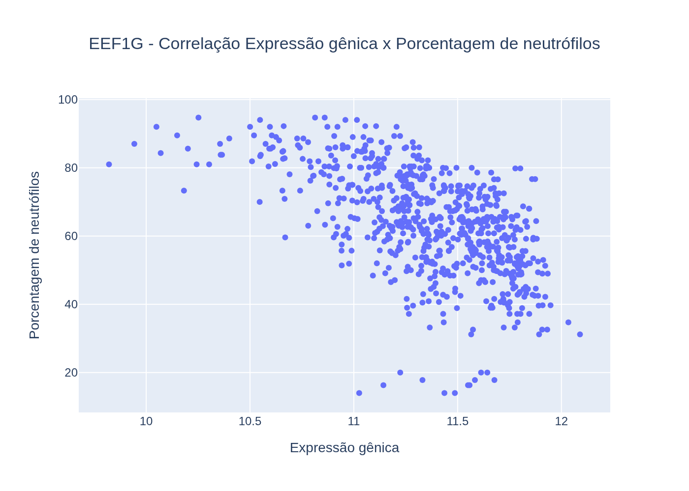
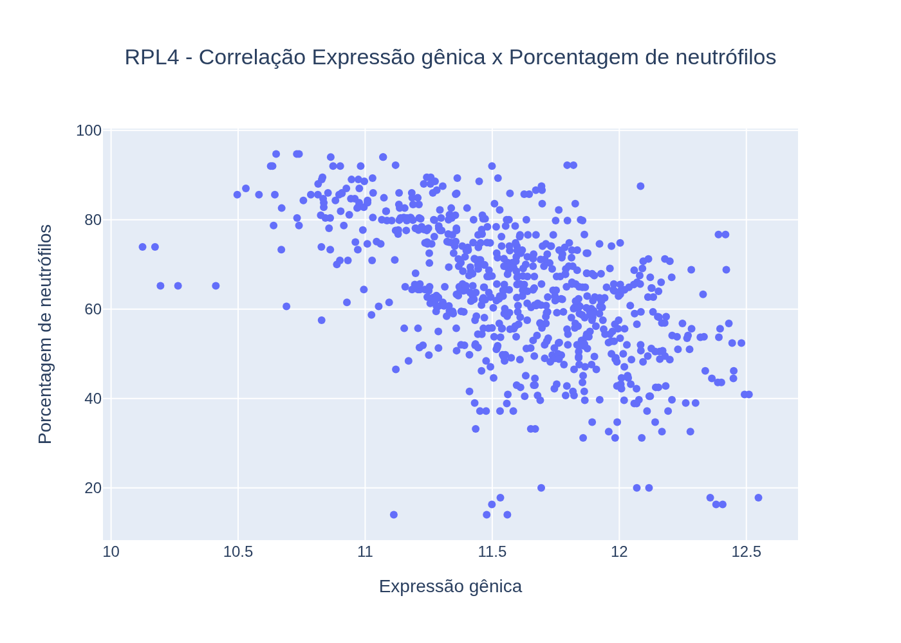
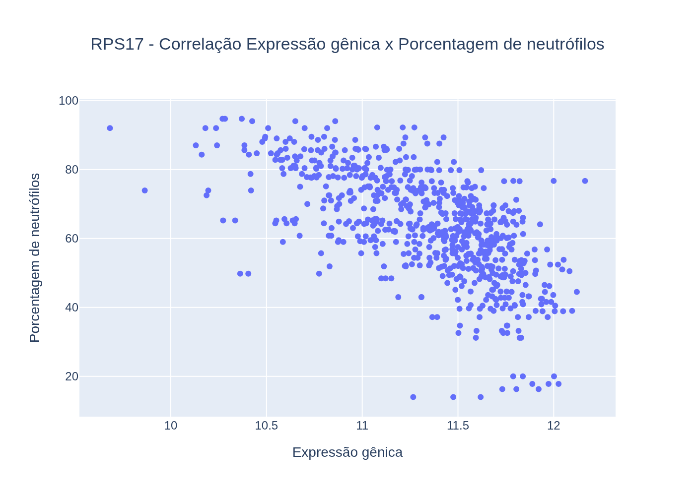

# Projeto Do Gênero ao Genoma: Entendendo o Lúpus através da Visualização de Dados e Análise de Sinalização Celular
# Project From Gender to Genome: Understanding Lupus through Data Visualization and Cell Signaling Analysis

# Descrição Resumida do Projeto

O lúpus é uma doença autoimune de causa multifatorial (genética, hormonal e ambiental), ocorrendo mais comumemente em mulheres e pessoas de ascendência africana, hispânica e asiática, com o cromossomo X sendo um possível fator de risco. O LES é caracterizado por uma falha no sistema imunológico: após a morte celular, fragmentos de DNA e proteínas são erroneamente identificados como invasores, desencadeando uma resposta autoimune que causa inflamação e lesão tecidual. Essa falha está associada a alterações em genes e proteínas ligadas à apoptose. Por ser uma doença crônica e sem cura, o tratamento visa controlar os sintomas, utilizando desde protetor solar e anti-inflamatórios em casos leves, até corticosteroides e imunossupressores em quadros mais graves.

Este estudo busca entender a natureza do lúpus em suas manifestações mais profundas. Primeiramente, investiga a predominância da doença em mulheres, analisando se a expressão diferencial dos genes explicaria esta predominancia. Em seguida, foca na progressão da doença, buscando identificar os grupos de genes que diferenciam pacientes leves dos que têm surtos graves, para então compreender as funções celulares que estes genes exercem. Os resultados alcançados apontam as hnRNPs (ligadas ao metabolismo de RNA) como principais diferenciadores entre indivíduos saudáveis e lúpicos, identificam a proteína HNRNPU (associada à inativação do cromossomo X) como possível chave para a predominância feminina, e revelam uma regulação negativa de proteínas ribossomais em casos graves, sugerindo impactos do tratamento imunossupressor ou ação direta de autoanticorpos.

# Slides

[Slides da terceira apresentação](assets/slides/apresentação-projeto3.pdf)

# Fundamentação Teórica

O lúpus é uma doença autoimune inflamatória crônica que pode afetar múltiplos órgãos, pele, articulações, rins, coração e sistema nervoso. Do ponto de vista imunológico, o LES resulta de uma falha nos mecanismos de tolerância imune, frequentemente associada a apoptose anormal. Quando as células morrem, fragmentos de DNA e nucleossomos permanecem expostos e são captados por células apresentadoras de antígeno (APCs), que passam a apresentá-los como se fossem invasores. Esse evento ativa linfócitos T autorreativos, que por sua vez estimulam linfócitos B a produzirem autoanticorpos contra o próprio DNA e proteínas nucleares. A formação de imunocomplexos e sua deposição em tecidos leva à inflamação persistente, ativação do sistema complemento e lesão tecidual. Estudos mostram que essa perda de tolerância está associada a alterações genéticas e funcionais em proteínas-chave das vias extrínseca e intrínseca da apoptose, como Fas, FasL, Bax, Bcl-2 e p53, bem como em seus genes reguladores. A expressão modificada desses genes em células T CD4+ e CD8+, acompanhada por altas taxas de apoptose, contribui para a desregulação das vias apoptóticas e, consequentemente, para a quebra da tolerância imunológica periférica que caracteriza o desenvolvimento do LES.

O diagnóstico é mais frequente entre os 15 e 40 anos, mas pode ocorrer em qualquer faixa etária. É mais comum entre pessoas afro-americanas, hispânicas e asiáticas. Dados epidemiológicos indicam que a incidência chega a ser três a quatro vezes maior em mulheres negras do que em mulheres brancas. De modo geral, a doença acomete mais mulheres do que homens. A razão para a predominância do lupus em mulheres ainda não é totalmente compreendida, mas há fortes evidências de que esteja relacionada ao processo de inativação do segundo cromossomo X por meio da molécula Xist. Trata-se de um RNA não codificador (ncRNA) presente em fêmeas de mamíferos, responsável pela inativação de um dos cromossomos X. No entanto, essa inativação não é completa, e alguns genes permanecem ativos. Estudos indicam que a ação da Xist, combinada à suscetibilidade genética, favorece o desenvolvimento de autoanticorpos e de doenças autoimunes como o lúpus.

Clinicamente, o lúpus manifesta-se por fadiga, febre, artralgia, fotossensibilidade, alopecia, linfadenopatia e rash malar em “asa de borboleta”. Em casos graves, podem ocorrer nefrites, vasculites, pleurites, pericardites e alterações neurológicas. O diagnóstico é desafiador e baseado em critérios clínicos e laboratoriais definidos pela EULAR/ACR (2019), incluindo a presença de anticorpos antinucleares (ANA), anti-DNA e anti-Sm, além de achados hematológicos e renais.

O lúpus é uma doença crônica e sem cura. Os tratamentos disponíveis visam apenas ao controle dos sintomas. Desde 1950, os corticosteroides passaram a ser utilizados como ferramenta terapêutica. Em casos mais leves, são empregados anti-inflamatórios não esteroides, protetor solar e corticosteroides tópicos para as lesões cutâneas. Já em quadros graves, são necessárias drogas imunossupressoras e agentes citotóxicos.

## Avaliação Clínica e Índice de Atividade SLEDAI

O curso clínico do LES é marcado por períodos de atividade e remissão, exigindo um acompanhamento constante. Para mensurar a atividade inflamatória sistêmica, foram desenvolvidos índices padronizados, entre eles o ECLAM, SLAM, BILAG e o SLEDAI (Systemic Lupus Erythematosus Disease Activity Index), o mais utilizado mundialmente. Este índice avalia 24 parâmetros clínicos e laboratoriais observados nos últimos 10 dias. Cada item recebe uma pontuação fixa (1, 2, 4 ou 8), de acordo com sua gravidade e impacto fisiopatológico. A soma total define o grau de atividade da doença:

- SLEDAI 1–5: atividade leve
- SLEDAI 6–10: atividade moderada
- SLEDAI 11–19: atividade alta
- SLEDAI ≥ 20: atividade muito alta

Embora o escore máximo teórico seja 105, valores tão altos são raros na prática clínica. O SLEDAI-2K também permite a contagem de alguns achados persistentes (como proteinúria, rash ou alopecia), que na versão original eram contabilizados apenas quando novos.

### Parâmetros clínicos e laboratoriais avaliados no SLEDAI

Os 24 descritores do SLEDAI abrangem 8 sistemas orgânicos, avaliando manifestações inflamatórias ativas atribuíveis exclusivamente ao lúpus (excluindo causas infecciosas, metabólicas ou medicamentosas):

<ol type="a">
    <li>Sistema Nervoso Central (8 pontos cada): Inclui convulsões, psicose, acidente vascular cerebral, cefaleia lúpica e neuropatias cranianas, manifestações que refletem inflamação neurovascular autoimune.</li>
    <li>Sistema Vascular (8 pontos) : Vasculite sistêmica caracterizada por úlceras, nódulos, gangrena digital ou achados angiográficos inflamatórios.</li>
    <li>Sistema Musculoesquelético (4 pontos cada): Abrange artrite inflamatória em múltiplas articulações e miosite confirmada clinicamente ou por exames laboratoriais.</li>
    <li>Sistema Renal (4 pontos cada): Avalia proteinúria, hematúria, piúria e presença de cilindros urinários, indicadores de nefropatia lúpica ativa.</li>
    <li>Sistema Cutâneo e Mucoso (2 pontos cada): Inclui rash cutâneo, alopecia e úlceras orais ou nasais, representando atividade periférica da doença.</li>
    <li>Serosas (2 pontos cada): Pleurite e pericardite, evidenciadas por dor torácica, atrito, derrame ou alterações ecocardiográficas.</li>
    <li>Imunológicos (2 pontos cada): Redução de C3, C4 ou CH50 e elevação de anticorpos anti-DNA de fita dupla, indicando reativação imunológica sistêmica.</li>
    <li>Hematológicos e Constitucionais (1 ponto cada): Febre não infecciosa, leucopenia e trombocitopenia, expressando resposta inflamatória sistêmica e autoimune ativa.</li>
</ol>

## Análise de Co-Expressão Gênica e Identificação de Hubs em Lúpus Cutâneo

Em linha com as técnicas de análise de dados genéticos, o estudo de Nickles et al. (2020) foi selecionado para análise, apesar de focar inicialmente em lúpus eritematoso discóide (LED) e sarcoidose cutânea (CS), e não diretamente no lúpus eritematoso sistêmico (LES). O objetivo do estudo era analisar a rede de co-expressão gênica para caracterizar semelhanças e diferenças entre CS, LED e psoríase, com foco na identificação de *hubs* que pudessem apontar para padrões comuns, auxiliando em terapias futuras para cada doença.

A análise partiu de dois *datasets* (GSE32887 e GSE52471) disponíveis no repositório GEO, filtrando os genes comuns entre eles. A técnica *Weighted Gene Co-expression Network Analysis (WGCNA)* foi aplicada para agrupar genes com perfis de expressão semelhantes em módulos.

O módulo de interesse foi definido por apresentar três características:

1. Estar presente em ambos os *datasets*.
2. Estar relacionado à ativação imunológica de leucócitos.
3. Estar aumentado nas lesões de CS e LED.

Os *hubs* potenciais foram definidos por meio de duas abordagens complementares:

1. Conectividade Intramodular Alta (WGCNA): Os genes que estavam no top 5% dos mais conectados internamente ao módulo.
2. Centralidade Alta (STRING): Alto grau de interação proteína-proteína (PPI), construída através do STRING e visualizada no Cystoscape, com índice de confiança superior a 0.7.

Sete genes foram identificados em comum nas duas classificações, sendo considerados *hubs* verdadeiros. Estes genes são: TLR1, ITGAL, TNFRSF1B, CD86, SPI1, BTK e IL10RA. A relevância biológica desses *hubs* foi confirmada por meio de análise de expressão diferencial (com p-valor < 0.01) e enriquecimento funcional, validando sua importância nos mecanismos imunológicos das doenças.

# Perguntas de Pesquisa

A seguir, são descritas as perguntas de pesquisa que dirigiram esse trabalho, bem como as conclusões obtidas com base nos resultados:

1. Porque o lúpus afeta mais mulheres do que homens? Através dos genes mais expressos em pacientes com lúpus, conseguimos perceber alguma razão para esta predominância?
    > A proteína HNRNPU, associada com inativação do cromossomo X em mulheres, foi identificada como uma das mais centrais (*eigenvector*) da rede de interação proteica gerada após análise de expressão diferencial entre pacientes com lúpus e pacientes sem lúpus.

2. Quais grupos de genes distinguem pacientes com lupus de pacientes sem lupus? Qual é a sua função na célula?
    > O principal grupo de proteínas identificadas pela análise de centralidade (*eigenvector*) foi o das *heterogeneous nuclear ribonucleoproteins*, que participam de vários aspectos do metabolismo de ácidos nucleicos, incluindo *splicing* alternativo , estabilização de mRNA e regulação transcricional e traducional.

3. Quais grupos de genes distinguem pacientes que permanecem com estados clínicos leves (baixo SLEDAI) daqueles que evoluem para surtos graves (alto SLEDAI)? Estes genes estão relacionados a quais atividades da célula?
    > Os principais grupos de proteinas identificados pela análise de centralidade foram os das *ribosomal proteins*, que compõem a estrutura dos ribossomos e são essenciais para a síntese proteica.

# Metodologia

Os dados utilizados neste estudo foram obtidos do banco público GEO (Gene Expression Omnibus), especificamente do dataset GSE121239, que contém informações de um estudo longitudinal de pacientes com lúpus eritematoso sistêmico (LES). Este conjunto de dados inclui perfis de expressão gênica, escores clínicos de atividade da doença (SLEDAI) e percentuais de neutrófilos. Inicialmente, as amostras foram divididas em grupos de acordo com dois critérios principais:

1. Lúpus versus indivíduos saudáveis
2. Lúpus leve versus lúpus grave, com base no escore SLEDAI.
3. Lúpus levissimo vs. lúpus gravissimo, com base no escore SLEDAI para os pacientes que apresentaram ambas as condições.

A separação dos grupos lupus e indivíduos saudáveis foi feita utilizando a ferramenta GEO2R, que permite análises estatísticas diretas a partir da base GEO. Já a separação entre os grupos com lúpus leve e lúpus grave foi feita utilizando Python.

Para cada comparação, foi conduzida uma análise de expressão gênica diferencial, a fim de identificar genes diferencialmente expressos entre os grupos. Em seguida, os genes diferencialmente expressos foram submetidos à construção de uma rede de interação proteína-proteína (PPI) por meio da plataforma STRING, possibilitando a visualização das interações funcionais entre as proteínas codificadas pelos genes identificados.
As redes obtidas foram analisadas quanto à centralidade dos nós, com o objetivo de identificar proteínas potencialmente mais influentes ou centrais nas interações moleculares relacionadas ao lúpus.
Por fim, os resultados das análises de centralidade e interação foram integrados em uma interpretação biológica, buscando compreender os mecanismos moleculares e vias biológicas envolvidas na atividade e gravidade do lúpus eritematoso sistêmico.


## Bases de Dados e Evolução

Base de Dados | Endereço na Web | Resumo descritivo
----- | ----- | -----
Longitudinal Stratification of Gene Expression Data Reveals Three SLE Groups of Disease Activity Progression. | <https://www.ncbi.nlm.nih.gov/geo/query/acc.cgi?acc=GSE121239> | Uma matriz de correlação foi calculada para analisar a relação entre a expressão de cada gene e a atividade da doença. Os genes mais relevantes foram selecionados para estratificar os pacientes, permitindo a realização de uma análise de agrupamento para identificar subgrupos.
Gene Ontology | <https://geneontology.org/> | Maior fonte de informações do mundo sobre as funções dos genes.

Esta base de dados apresenta várias amostras associadas a cada paciente, correspondendo a diferentes visitas deste indivíduo ao longo do tempo. Sendo assim, essa base foi processada de forma a agrupar os dados de cada paciente em um novo conjunto de dados no qual cada entrada corresponde à série histórica de um paciente, permitindo a realização de uma análise da progressão da doença em cada indivíduo.

Com base nisso, os pacientes foram agrupados de acordo com o nível de atividade da doença (SLEDAI), possibilitando a realização de uma análise de expressão diferencial para identificar os principais genes resposáveis por determinar o nível de atividade da doença e, posteriormente, uma análise de correlação entre a atividade desses genes e a porcentagem de neutrófilos na amostra de sangue.

## Modelo Lógico


## Análises Realizadas e Discussão dos Resultados Obtidos

### Lúpus x Saudável

Foi realizada a separação dos grupos de pacientes com lúpus versus indivíduos saudáveis via GEO2R. Utilizamos um limiar de p-valor de 0,05 e limitamos a expressão diferencial para ser |log2FC| > 1. Depois, colocamos no STRING para gerar a rede de proteínas considerando apenas as interações físicas. A análise de grau e centralidade foi feita no Cytoscape.


A análise de centralidade e conectividade entre proteínas de indivíduos saudáveis revelou genes com alto grau de conectividade (*degree*) e importância topológica (*eigenvector*) nas redes de interação proteína-proteína (PPI). Esses genes representam **nós centrais** com papel potencialmente regulador na fisiopatologia do lúpus.

#### Proteínas com maior Eigenvector

A análise de centralidade destacou um agrupamento de **ribonucleoproteínas nucleares heterogêneas (hnRNPs)** entre as proteínas mais conectadas: **HNRNPD, HNRNPH1, SRSF6, HNRNPL, HNRNPU, HNRNPR e FUS**.

Essas proteínas participam de processos essenciais do **metabolismo do RNA**, como *splicing* alternativo, estabilização de mRNA e regulação da transcrição e tradução. Alterações nesses mecanismos são recorrentes em doenças autoimunes, incluindo o LES. Além disto, percebemos que estas proteínas centrais estão conectadas com proteínas como:

- IFIT1 e IFIT3, que são proteínas induzidas por intérferons (ativadas pela resposta imune);
- CANX, que também funciona como uma chaperona para o dobramento da cadeia α do MHC de classe I;
- MAPK, relacionada à proliferação e expansão de linfócitos B;
- MYC, regulador de crescimento celular.



#### Função e Relevância dos Genes Identificados

**Gene** | **Função Principal** | **Impacto no Lúpus**
-----------|----------------------|----------------------
**HNRNPD (AUF1)** | Regula a estabilidade de mRNAs inflamatórios (ex.: TNF e IL-6). | Sua perda leva ao acúmulo de citocinas pró-inflamatórias → **inflamação sistêmica**.
**HNRNPH1** | Proteína de ligação ao pré-mRNA; atua no *splicing* alternativo e regulação pós-transcricional. | Atua como **autoantígeno** no LES e AR; autoanticorpos contra HNRNPH1 associam-se à **progressão da doença** e têm potencial como **biomarcadores**. [Zhu et al., 2025](https://doi.org/10.3390/ijms26115159)
**SRSF6** | Fator de *splicing* rico em serina/arginina, regula isoformas alternativas. | Superexpressão pode modular o *splicing* de genes ligados à **resposta IFN tipo I** e apoptose. [Kosmara et al., 2023](https://doi.org/10.3390/cells12232678)
**HNRNPL** | Atua no *splicing* de receptores imunes como **CD45** e receptores T. | Alterações em HNRNPL levam à **ativação exagerada de linfócitos T** e resposta autoimune aumentada.
**HNRNPU (SAF-A)** | Proteína nuclear multifuncional que **ancora RNA à cromatina**, organiza a arquitetura nuclear e regula transcrição, *splicing* e reparo de DNA. | Interage com **lncRNA IL21-AS1**, promovendo **IL-21**, ativação de linfócitos B e produção de autoanticorpos. Pode também estar associada à **inativação do cromossomo X**, explicando a **predominância do lúpus em mulheres**. [Liu et al., 2025](https://doi.org/10.1371/journal.pgen.1011719)
**HNRNPR** | Regula o processamento de RNA sob estresse celular. | Amplifica a **sinalização interferon-dependente** e **mecanismos inflamatórios nucleares**.
**FUS** | Mantém a homeostase de RNA e forma condensados nucleares sob estresse oxidativo. | Contribui para a **formação de grânulos inflamatórios**, promovendo inflamação persistente.

#### Significado Biológico Geral

A predominância das **hnRNPs** entre as proteínas centrais sugere que **alterações no processamento e controle pós-transcricional do RNA** representam um **mecanismo-chave do LES**.
Ao observarmos a que estas proteínas estão conectadas, percebemos queestas proteínas centrais estão conectadas com proteínas como:

- IFIT1 e IFIT3, proteínas induzidas por interferon tipo I (ISGs), que participam da resposta antiviral e inflamatória mediada por IRF7 e JAK/STAT, frequentemente exacerbada em pacientes com LES;
- CANX (calnexina), chaperona do retículo endoplasmático envolvida no dobramento e montagem de glicoproteínas do MHC classe I, essencial para a apresentação de antígenos e reconhecimento imunológico;
- MAPK3 (ERK1), quinase ativada em vias de proliferação e diferenciação celular, possivelmente relacionada à expansão de linfócitos B autorreativos e à hiperprodução de autoanticorpos;
- MYC, um regulador transcricional multifuncional que controla crescimento celular, metabolismo e ativação imune, e cuja superexpressão pode reforçar o estado de ativação imune sustentada típico do LES.

Essas proteínas formam um **núcleo funcional** responsável por:

- Regular genes interferon-dependentes (ISGs)
- Modular a resposta inflamatória
- Influenciar a organização epigenética do **cromossomo X**

Particularmente, a **HNRNPU** apresentou alta centralidade e relevância biológica por conectar três dimensões críticas da doença (Liu et al., 2025; Sharp et al., 2025). Primeiro, ela interage com genes estimulados por interferon (ISGs), contribuindo para a robusta IFN signature observada em pacientes com lúpus. Segundo, exerce papel estrutural na manutenção do cromossomo X inativo, ancorando o RNA XIST ao Xi e impedindo a reativação de genes imunológicos como TLR7, CD40L e CXorf21, cuja desregulação amplifica respostas inflamatórias. E terceiro, se relaciona à via IL-21 e à ativação de linfócitos B, contribuindo para a produção de autoanticorpos. A expressão diferencial do HNRNPU oferece uma possível explicação coerente para o predomínio feminino do lúpus, já que a desregulação da inativação do X pode intensificar a resposta imune em mulheres. Entretanto, nossos dados não registram o sexo dos pacientes, impedindo afirmar se a maior expressão de HNRNPU observada é causa do viés feminino ou apenas reflexo da predominância de mulheres entre os casos de lúpus.

- **Genes ISG**, associados ao *IFN signature* do lúpus [Liu et al., 2025](https://doi.org/10.1371/journal.pgen.1011719)
- **Mecanismos epigenéticos do cromossomo X**, que podem contribuir para a **predominância feminina da doença** [Liu et al., 2025](https://doi.org/10.1371/journal.pgen.1011719)
- **Ativação da via IL-21 → linfócitos B → autoanticorpos**, sustentando a **resposta autoimune exacerbada**

### Lúpus Leve x Lúpus Medio/Grave

Devido à baixa amostragem de pacientes com SLEDAI grave (maior que 11), como mostrado nos gráficos a seguir, optou-se por agrupar os tipos médios e graves para evitar vieses em análises futuras.




Além disso, o dataset trabalha com dados longitudinais, onde cada paciente possui diversas observações ao longo do tempo, com diferentes valores de SLEDAI atrelados. Como a base de dados já é suficientemente grande e desproporcional em termos da quantidade de amostras leves e médias/graves, optou-se por selecionar apenas a observação com maior valor de SLEDAI por paciente.

Para calcular a expressão diferencial de cada gene, foi aplicado o teste de t para amostras independentes (t-test). A seguir, é exibido um trecho simplificado da função utilizada para o cálculo:

```python
def ttest_for_gene(gene):
    # Separa gene dos grupos de análise
    group1 = df[(df['main_gene'] == gene) & (df['class_group'] == 'leve')]['gene_expression_value']
    group2 = df[(df['main_gene'] == gene) & (df['class_group'] == 'medio/grave')]['gene_expression_value']

    # Gera pvalor da expressão diferencial
    _, pval = stats.ttest_ind(group1, group2, equal_var=False)
    checkpoint[gene] = {'pval': pval, 'mean_leve': group1.mean(), 'mean_grave': group2.mean()}
```

Assim como na análise anterior, utilizamos um limiar de p-valor de 0,05 e limitamos a expressão diferencial para |log2FC| > 1.

#### Proteínas com maior Eigenvector



Diversas proteínas ligadas à síntese de proteínas apareceram menos expressas no lúpus grave, incluindo RPL4, RPLP0 e RPL12 (componentes da subunidade 60S do ribossomo), bem como os fatores de elongação EEF2 e EEF1G. Proteínas regulatórias e nucleares, como PPP1R26, RUVBL1 e ATP5F1B, também apresentaram queda de expressão.

Estes resultados foram particularmete contraditórios, esperávamos uma alta síntese proteica nos pacientes com lupus devido a maior produção de anticorpos. No entanto, esse conjunto sugere uma possível disfunção da maquinaria de tradução, especialmente porque várias dessas proteínas são alvos conhecidos de autoanticorpos no LES, o que pode reduzir sua estabilidade ou síntese. Outros fatores também podem explicar a redução, como uso de corticosteroides, estresse inflamatório intenso ou baixa representatividade de pacientes com SLEDAI grave na amostra. Assim, a queda dessas proteínas pode refletir um cenário multifatorial, combinando autoimunidade, tratamento e efeitos da gravidade da doença.

### Lúpus Levissimo x Lúpus Gravíssimo

Em decorrência dos resultados contraditórios observados na análise anterior, e considerando o desbalanceamento entre pacientes com SLEDAI leve e grave, optou-se por realizar uma terceira análise. Observando a distribuição do SLEDAI, é possível notar que a maioria das amostras classificadas como "média/grave" está na faixa de 7 a 11 pontos, o que é próximo à fronteira do que foi considerado leve.



Assim, decidimos criar duas novas categorias para a divisão dos pacientes: "levissimo" (SLEDAI entre 1 e 3) e "gravissimo" (SLEDAI maior ou igual a 10), e buscar pacientes que estiveram em ambas categorias ao longo da série histórica, e selecionamos as respectivas amostras. Como as amostras de cada grupo vinham dos mesmos pacientes, ambos tiveram a mesma quantidade de amostras:



Com isso, executamos novamente a análise de expressão diferencial, dessa vez utilizando o teste t pareado por se tratarem de amostras de um mesmo paciente. Em vez de gerar uma nova rede de interação proteína-proteína e encontrar as proteínas mais centrais, buscamos apenas os valores de expressão diferencial para as proteínas centrais da rede anterior. Os resultados foram os seguintes:

Gene | P-Valor | Log2FC
--- | --- | ---
RPLP0 | 0.0001 | -0.0324
RPL12 | 0.0007 | -0.0293
EEF1G | 0.0429 | -0.0171
KARS1 | 0.0469 | -0.0334
EEF2 | 0.1880 | -0.0168
PPP1R26 | 0.2284 | -0.0446
RPS17 | 0.2544 | -0.0104
RPL4 | 0.8348 | -0.0017

Note que a análise foi realizada dividindo o nível de expressão gênica das amostras graves pelas amostras leves, logo valores negativos de log2FC indicam que o gene foi menos expresso nos pacientes graves. Sendo assim, podemos notar que todos os genes selecionados continuam menos expressos nos pacientes graves, mantendo a mesma tendência contraditória observada na análise anterior. Uma possível explicação para isso é que, de acordo com o artigo, todos os pacientes que apresentaram sintomas receberam algum tipo de tratamento, que não foi especificado. Além disso, quando comparado a diferença absoluta no SLEDAI entre visitas para um mesmo paciente, foi observado que em 70% dos casos o paciente tem uma redução na sua taxa. Isso significa que o tratamento aplicado de fato surte um efeito positivo, o que explicaria o fato dos principais genes estarem menos expressos em casos graves que em casos leves.

### Correlação com Neutrófilos

A última análise realizada foi uma correlação entre a expressão gênica dos genes mais centrais na análise "leve versus médio/grave" e a porcentagem de neutrófilos na amostra de sangue. O objetivo desta análise era identificar se a expressão gênica desses genes era diretamente relacionada com a quantidade de neutrófilos na amostra de sangue, o que seria uma indicação de que esses genes podem ser usados como um indicador facilmente mensurável de atividade da doença, ao contrário do SLEDAI, que depende de critérios subjetivos ou pouco mensuráveis.

Para isso, aplicamos a correlação de Pearson por meio da função `pearsonr` do pacote `scipy.stats`. Os resultados foram os seguintes:

Gene | Correlação
--- | ---
RPLP0 | -0.43
RPL12 | -0.45
EEF1G | -0.58
KARS1 | -0.24
EEF2 | -0.30
PPP1R26 | -0.23
RPS17 | -0.65
RPL4 | -0.56

Como podemos ver na tabela, todos os genes aresentaram valores negativos para a correlação, indicando que a porcentagem de neutrófilos decresce linearmente com o aumento da expressão gênica. Filtrando os genes que apresentaram correlação de Pearson maior que 0.5 (em valor absoluto), foram gerados os seguintes gráficos:







## Evolução do Projeto

Embora a modelagem lógica definida no início do projeto tenham se mostrado robustas e não tenha exigido alterações estruturais significativas, a fase de execução e processamento dos dados apresentou desafios técnicos e analíticos que demandaram adaptações importantes no fluxo de trabalho. Abaixo, são detalhadas as principais evoluções no desenvolvimento do projeto:

### 1. Transição de Ferramentas: Do GEO2R para Jupyter Notebooks

Inicialmente, definição dos grupos e análise preliminar dos dados de expressão gênica seriam realizadas através da ferramenta web GEO2R, disponibilizada pelo NCBI. Para a análise "saudável vs lúpus", a ferrammenta se mostrou adequada e pudemos utilizá-la para obter os dados de expressão gênica. No entanto, para a análise "lúpus leve vs lúpus grave", enfrentamos travamentos constantes na plataforma, que se mostrou incapaz de lidar com a complexidade e o volume das requisições necessárias para o estudo.

Sendo assim, decidimos abandonar a interface web para esse caso e migrar o *pipeline* de análise para um ambiente de desenvolvimento local utilizando Jupyter Notebook. Essa mudança não apenas resolveu o problema de estabilidade, mas garantiu a reprodutibilidade da pesquisa, permitindo a documentação passo a passo do código e a personalização dos algoritmos de pré-processamento que teriam que ser manuais no GEO2R (em especial, o agrupamento das amostras referentes a um mesmo paciente e classificação dos pacientes de acordo com o escore SLEDAI).

### 2. Otimização Computacional: Paralelização do Código

Um desafio subestimado no início do projeto foi a dimensionalidade dos dados. Ao lidar com a análise de expressão gênica de cerca de 20.2 mil genes simultaneamente, a execução sequencial dos scripts tornou-se inviável, resultando em tempos de processamento proibitivos.

Para lidar com isso, foi necessário refatorar o código de análise para implementar técnicas de paralelização. A distribuição da carga de trabalho entre os núcleos de processamento reduziu drasticamente o tempo de execução (apesar de ainda ter demorado cerca de 11h), permitindo iterar sobre os genes mais rapidamente e viabilizando a análise de todo o conjunto gênico.

### 3. Refinamento Analítico: Reinterpretação de Resultados Contraintuitivos

Durante a validação das hipóteses, nos deparamos com resultados que contradiziam a literatura clássica inicial ou o senso comum esperado (ex: genes que esperávamos estar mais expressos no grupo lúpus grave em relação ao grupo lúpus leve estavam, na verdade, menos expressos).

Isso nos forçou aprofundar a investigação na literatura biológica recente e elaborar hipóteses alternativas para explicar os resultados obtidos. Algumas hipóteses levantadas para explicar isso foram o impacto de um possível tratamento com corticosteroides, o fato de essas proteínas serem alvos de autoanticorpos ou a ocorrência de uma disfunção ribossômica.

# Ferramentas

- **Python** / **Jupyter Notebook**, para processamento das bases de dados e análise dos dados.
- **GEO2R**, para análise de expressão diferencial de genes.
- **STRING**, para obter informações sobre interação entre proteínas.
- **Cytoscape**, para geração de grafos de redes e análise utilizando técnicas de ciência de redes.

## GEOparse

Existe uma biblioteca chamada GEOparse, disponível em Python, para baixar e tratar diretamente os dados vindos do repositório GEO, sem a necessidade de baixar os dados de maneira externa. Com isso, os dados ficam encapsulados em um objeto contendo os metadados tanto dos pacientes como da expressão gênica de cada paciente. De forma a aproveitar esse recurso, juntamente com o pré-processamento específico para tratar os dados de Lúpus, foi construída uma classe `GeoParser` que absorve os métodos disponíveis na biblioteca original. Com isso, através de apenas duas linhas de código, ambos os dataframes são gerados formatados, pronto para serem analisados.

```python
# Cria objeto parser
parser = GEOParser(geo_id="GSE121239", destdir="../../data/raw/", meta_map=meta_map)

# Parse dos dados e armazena em tabelas
gene_data, patient_data = parser.parse()
```

# Conclusão

O desenvolvimento deste projeto permitiu avançar na compreensão dos mecanismos moleculares do Lúpus Eritematoso Sistêmico (LES) através da integração de dados clínicos e de expressão gênica. As análises realizadas responderam às perguntas de pesquisa fundamentais, revelando *insights* biológicos significativos:

- **Predominância de Gênero:** A identificação da proteína HNRNPU como um nó central na rede de interação proteica ofereceu uma explicação plausível para a maior incidência da doença em mulheres. Sua associação com a inativação do cromossomo X e a regulação da via IL-21 sugere que falhas no silenciamento gênico e a consequente ativação imune exacerbada são fatores determinantes.
- **Diferenciação Patológica (Lúpus vs. Saudável):** O grupo das ribonucleoproteínas nucleares heterogêneas (*hnRNPs*) destacou-se como o principal diferenciador entre pacientes com lúpus e indivíduos saudáveis. Isso indica que o LES está intrinsecamente ligado a disfunções no metabolismo de RNA, incluindo *splicing* e estabilização de mRNA.
- **Progressão da Gravidade:** Ao comparar casos leves e graves, identificou-se que proteínas ribossomais (como RPL4 e RPLP0) e fatores de elongação são centrais para a distinção clínica. Contraintuitivamente, esses genes apresentaram-se menos expressos nos casos graves, sugerindo uma disfunção na maquinaria de tradução proteica ou efeitos associados ao tratamento. Além disso, observou-se uma correlação negativa entre a expressão desses genes centrais e a porcentagem de neutrófilos no sangue.

O caminho para alcançar esses resultados impôs diversos desafios técnicos e analíticos. A instabilidade da ferramenta web GEO2R para análises complexas (como a separação entre casos leves e graves) e a alta dimensionalidade dos dados (mais de 20 mil genes) tornaram o processamento inicial inviável e lento. Além disso, o desbalanceamento das amostras, com escassez de pacientes em estado grave (SLEDAI > 11), exigiu adaptações na estratificação dos grupos, levando à criação das categorias "levíssimo" e "gravíssimo" para validação.

As lições aprendidas durante o processo foram fundamentais para a maturidade do projeto. A migração para um ambiente de desenvolvimento local (Jupyter Notebooks) e a implementação de paralelisamo de código não apenas resolveram os gargalos de performance, reduzindo o tempo de execução, mas também garantiram maior reprodutibilidade e controle sobre o pré-processamento dos dados. Do ponto de vista biológico, a obtenção de resultados opostos ao esperado (a regulação negativa de genes ribossomais em surtos graves) ensinou a importância de não descartar dados contraditórios como erro, mas sim de investigar hipóteses alternativas, como o impacto imunossupressor de corticosteroides e a degradação proteica mediada por autoanticorpos.

# Trabalhos Futuros

Considerando as descobertas e os desafios metodológicos enfrentados, a continuidade deste estudo poderia beneficiar-se das seguintes abordagens:

- **Integração com Dados Epigenéticos:** Dada a identificação da proteína HNRNPU e sua relação com a inativação do cromossomo X como um potencial fator para a predominância feminina da doença, um desdobramento seria a análise integrada de dados de metilação do DNA e modificação de histonas. Isso permitiria investigar se o silenciamento incompleto do cromossomo X é, de fato, mediado por alterações epigenéticas nessas vias específicas.
- **Controle de Variáveis de Tratamento:** Para refinar a interpretação dos resultados "contraditórios" sobre a baixa expressão de genes ribossomais em casos graves, seria ideal replicar a análise em uma coorte de pacientes recém-diagnosticados (*naïve*) ou estratificar os dados pelo tipo e dosagem de imunossupressores/corticosteroides utilizados, informações que não estavam disponíveis no artigo associado ao *dataset* utilizado. Isso ajudaria a distinguir quais alterações moleculares são causadas pela patologia e quais são efeitos secundários da medicação.
- **Ampliação e Validação da Amostra:** Com mais tempo, seria fundamental expandir o estudo para *datasets* com um número maior de pacientes classificados com SLEDAI grave, corrigindo o desbalanceamento amostral observado.

# Referências Bibliográficas

BORBA, Eduardo Ferreira et al. Consenso de Lúpus Eritematoso Sistêmico. **Revista Brasileira de Reumatologia**, v. 48, n. 4, p. 196–207, 2008. Disponível em: [https://doi.org/10.1590/s0482-50042008000400002](https://doi.org/10.1590/s0482-50042008000400002).

Dia Mundial do Lúpus: por que as mulheres estariam mais propensas a desenvolver doenças autoimunes? Disponível em: [https://www.nationalgeographicbrasil.com/ciencia/2024/05/dia-mundial-do-lupus-por-que-as-mulheres-seriam-mais-propensas-a-desenvolver-doencas-autoimunes](https://www.nationalgeographicbrasil.com/ciencia/2024/05/dia-mundial-do-lupus-por-que-as-mulheres-seriam-mais-propensas-a-desenvolver-doencas-autoimunes). Acesso em: 2 set. 2025.

MALLAVARAPU, R. K.; GRIMSLEY, E. W. The history of lupus erythematosus. **Southern Medical Journal**, v. 100, n. 9, p. 896-898, 2007. Disponível em: [https://doi.org/10.1097/SMJ.0b013e318073c9eb](https://doi.org/10.1097/SMJ.0b013e318073c9eb).

MINISTÉRIO DA SAÚDE. **Lúpus**. Disponível em: [https://www.gov.br/saude/pt-br/assuntos/saude-de-a-a-z/l/lupus](https://www.gov.br/saude/pt-br/assuntos/saude-de-a-a-z/l/lupus). Acesso em: 2 set. 2025.

SANTANA, J. A. G. **Lúpus Eritematoso Sistêmico**: sua etiopatologia, patogênese e tratamento em alta. Disponível em: [https://www.ciencianews.com.br/arquivos/ACET/IMAGENS/biblioteca-digital/imunohematologia/4-Lupus-eritemasoso-sistemico.pdf](https://www.ciencianews.com.br/arquivos/ACET/IMAGENS/biblioteca-digital/imunohematologia/4-Lupus-eritemasoso-sistemico.pdf). Acesso em: 2 set. 2025.

WECKERLE, C. E.; NIEWOLD, T. B. The unexplained female predominance of systemic lupus erythematosus: clues from genetic and cytokine studies. **Clinical Reviews in Allergy & Immunology**, v. 40, n. 1, p. 42-49, 2011. Disponível em: [https://doi.org/10.1007/s12016-009-8192-4](https://doi.org/10.1007/s12016-009-8192-4).

YU, H. et al. Clinical and Immunological Biomarkers for Systemic Lupus Erythematosus. **Biomolecules**, v. 11, n. 7, p. 928, 2021. Disponível em: [https://doi.org/10.3390/biom11070928](https://doi.org/10.3390/biom11070928).

GLEESSE, Nadine. **O papel das proteínas apoptóticas na patogênese do lúpus eritematoso sistêmico**: uma abordagem imunogenética. 2015. Tese (Doutorado em Ciências Médicas) - Universidade Federal do Rio Grande do Sul, Porto Alegre, 2015. Disponível em: [https://lume.ufrgs.br/handle/10183/142034](https://lume.ufrgs.br/handle/10183/142034).

ZHU, Lijing et al. hnRNPH1: A Multifaceted Regulator in RNA Processing and Disease Pathogenesis. **International Journal of Molecular Sciences**, v. 26, n. 11, p. 5159, 2025. Disponível em: <https://doi.org/10.3390/ijms26115159>

KOSMARA, Despoina et al. Extensive alternative splicing patterns in systemic lupus erythematosus highlight sexual differences. **Cells**, v. 12, n. 23, p. 2678, 2023. Disponível em: <https://doi.org/10.3390/cells12232678>

SHARP, Judith A et al. Role of the SAF-A/HNRNPU SAP domain in X chromosome inactivation, nuclear dynamics, transcription, splicing, and cell proliferation. **PLoS genetics**, v. 21, n. 6, p. e1011719, 2025. Disponível em: <https://doi.org/10.3390/cells12232678>

MARENDA, Mattia; LAZAROVA, Elena; GILBERT, Nick. The role of SAF-A/hnRNP U in regulating chromatin structure. **Current Opinion in Genetics \& Development**, v. 72, p. 38–44, 2022. Disponível em: <https://www.sciencedirect.com/science/article/pii/S0959437X21001271>

LIU, Limin et al. LncRNA IL21-AS1 interacts with hnRNPU protein to promote IL21 overexpression and aberrant differentiation of Tfh cells in systemic lupus erythematosus. **Clinical and translational medicine**, v. 12, n. 12, p. e1117, 2022. Disponível em: <https://onlinelibrary.wiley.com/doi/pdf/10.1002/ctm2.1117>

NICKLES, M. A. et al. Gene Co-expression Networks Identifies Common Hub Genes Between Cutaneous Sarcoidosis and Discoid Lupus Erythematosus. Frontiers in Medicine, v. 7, p. 606461, 2020. Disponível em: <https://doi.org/10.3389/fmed.2020.606461>
